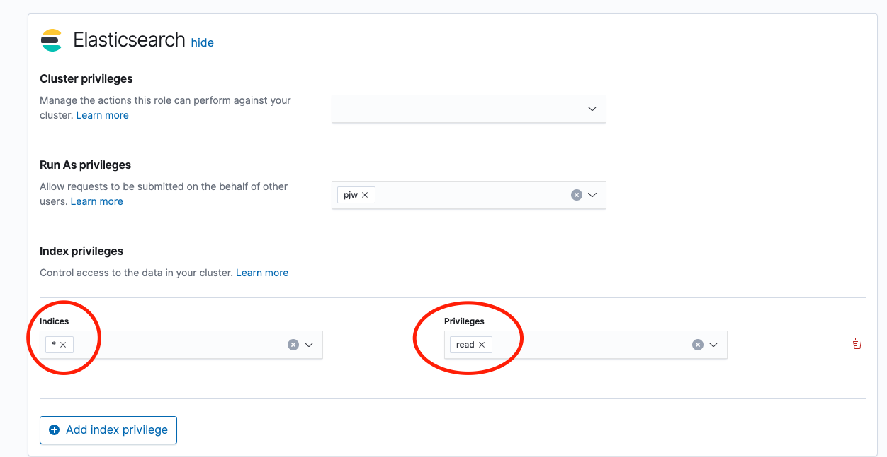
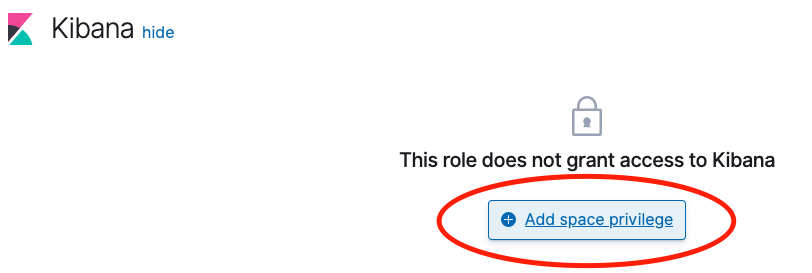
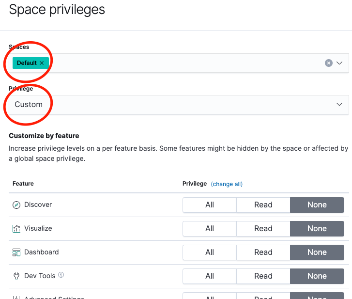
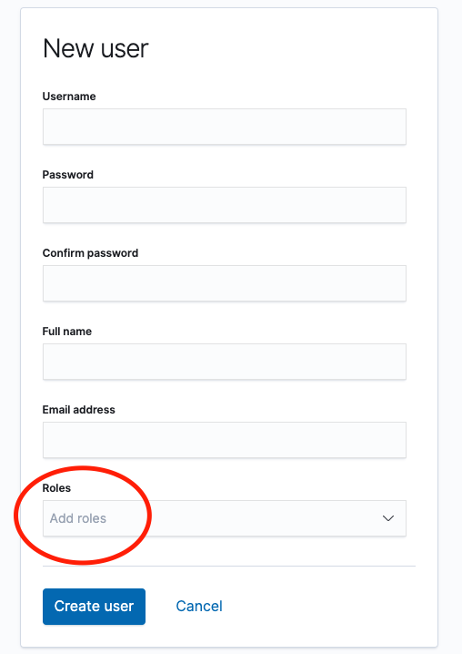

# 계정 설정

> 테스트 환경 정보 kibnan 7.2, elasticsearch 7.2

## 목차
- [권한 생성](#권한-생성)
- [계정 생성](#계정-생성)

## 권한 생성
- 메뉴 위치 : management/security/roles

- 접근 가능한 인덱스, 읽기, 쓰기 권한 설정

- 키바나 메뉴 설정

## 계정 생성
- 유저 생성시 앞서 생성한 권한 선택

